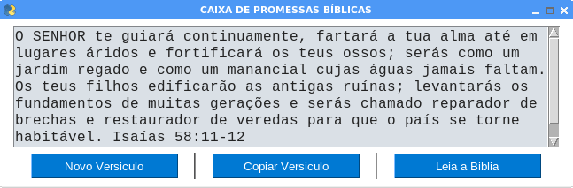

# Caixa_de_Promessas_Bíblicas

A Bíblia Sagrada é a Palavra de Deus. Leia a Bíblia diairiamente!

Interface gráfica usando <a href='https://github.com/PySimpleGUI/PySimpleGUI'>pysimplegui</a>

# Instalação:
- Acesse o terminal ou prompt de comando de seu computador e crie um clone deste projeto:
- git __clone https://github.com/elizeubarbosaabreu/CAIXA_DE_PROMESSAS_BIBLICAS.git__
- Sugiro que você utilize uma __máquina virtual__ para instalar os requerimentos: use __python -m venv c:\caminho\nome_da_maquina_virtual__ no Windows ou __python3 -m venv /caminho/nome_da_maquina_virtual__ se estiver no Linux. <a href='https://docs.python.org/pt-br/3/library/venv.html'>Documentação do venv aqui...</a>
- Entre dentro da pasta e instale os requerimentos:
- __cd /CAIXA_DE_PROMESSAS_BIBLICAS__
- __pip install -r requirements.txt__ se estiver no Windows
- __pip3 install -r requirements.txt__ se estiver utilizando o MAC ou Linux

# Usar o software:
- Use o Pycharm, Thonny, Vs Studio ou outra IDE python para rodar o arquivo 'App.py' para ter a interface gráfica...

# Obrigado por usar nosso aplicativo!!
